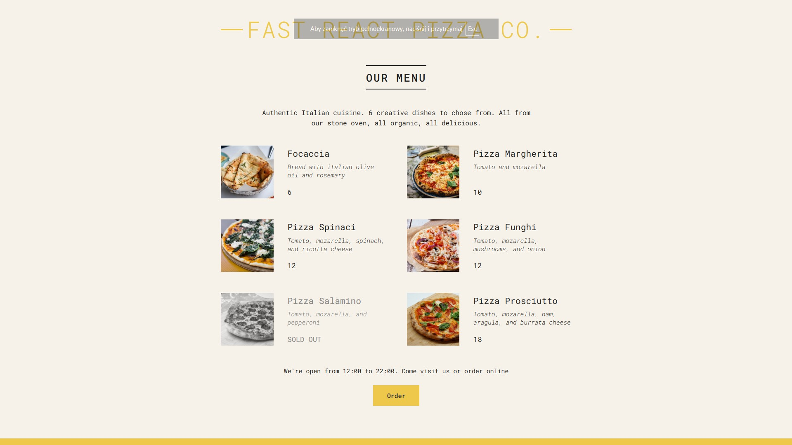

# 🍕 Fast React Pizza Co. (01)

Prosty komponentowy interfejs zbudowany w React. To moje pierwsze spotkanie z Reactem.  
Celem było zrozumienie działania komponentów, JSX, propsów oraz wykorzystania wyświetlania warunkowego.

Projekt wykonany w ramach kursu **"The Ultimate React Course 2025"** autorstwa Jonasa Schmedtmanna.

---

## 🔧 Funkcjonalności

- Wyświetlanie menu pizzy z danych (tablica obiektów)
- Dynamiczne renderowanie komponentów React
- Obsługa różnych stanów (dostępność pizzy, godziny otwarcia pizzerii)
- Podstawowa logika warunkowa i JSX
- Stylowanie komponentów z użyciem CSS Modules

---

## 🧠 Czego się nauczyłem

- Podstawy budowy komponentów w React
- Korzystanie z JSX i propsów
- Praca z listami i warunkowym renderowaniem
- Organizacja struktury projektu React
- Lepsze podejście do tworzenia skalowalnego UI

---

## 📸 Podgląd

<p align="center">
  

</p>

---

## 🚀 Live demo

🌐 *Link do wersji live (do uzupełnienia)*

---

## 🗂️ Stack technologiczny

- React (Create React App)
- JavaScript (ES6+)
- CSS Modules

---

## 📁 Uruchamianie lokalnie

```bash
git clone https://github.com/awitkowsky/react-pizza-menu.git
cd react-pizza-menu
npm install
npm start
